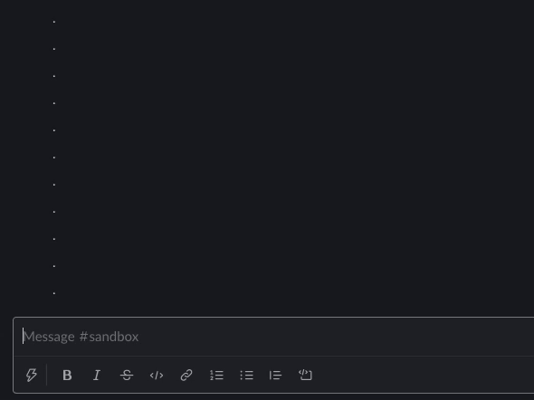

# ⚡️ Lightning Delete

Lightning Delete lets you delete your recent slack messages instantly. Just send 'd' (case-insensitive, no other text) to delete your last message. Send multiple 'd's (e.g. 'ddddd') to delete multiple messages.

<!-- Add to slack -->

## Demos

### Single

### Multiple

