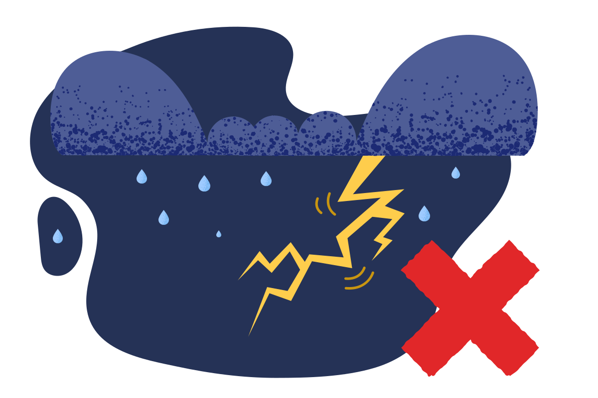
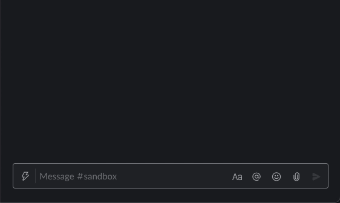
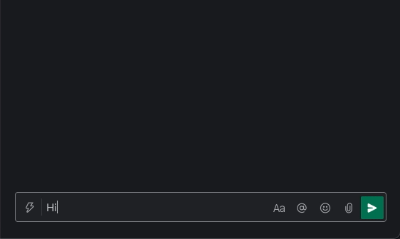

    
    <h1>Lightning Delete</h1>
    

        <b>Delete your recent slack messages. <i>Instantly ⚡️</i></b>
    

    

        
        
        
        
    

    
   
        <!-- Add to slack -->
        
    

     
     
     

## Usage

Send 'd' (case-insensitive, no other text) to delete your last message. Send multiple 'd's (e.g. 'ddddd') to delete multiple messages.

## Demos

### Single

### Multiple

## Related

- [Slack Info Bot](https://github.com/KhushrajRathod/SlackInfoBot)
- [Bolt Cross Workspace Starter](https://github.com/KhushrajRathod/BoltCrossWorkspaceStarter)